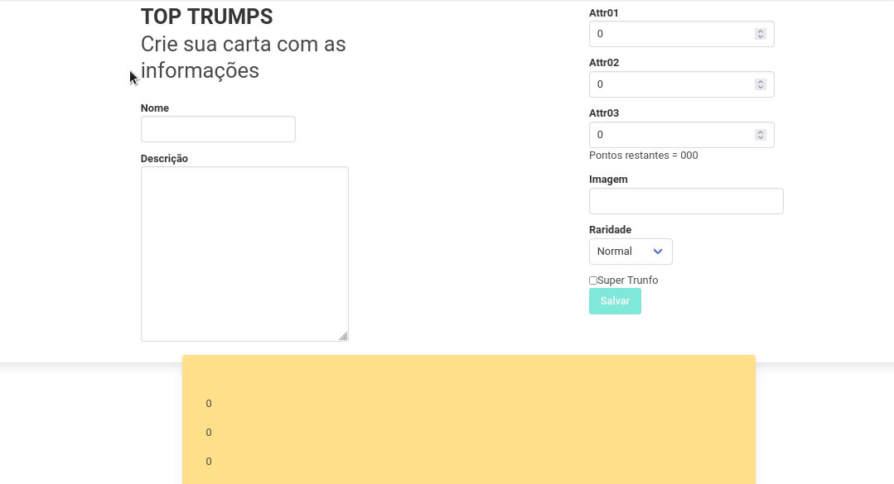

# Top Trumps
Here in Brazil we have a traditional game called *Super Trunfo*, that's the equivalent to Top Trumps in UK.

#### My goal here was to:
- Read the state of a React Component and use it to change what we display in the browser.
- Initialize a component, giving it a predefined state.
- Update the state of a component.
- Capture events using React syntax.
- Create forms using JSX syntax with tags: `input`, `textarea`, `select`, `form`, `checkbox`.
- Pass information from child components to parent components via callbacks.

#### I've built this project around february 2022, and at june, 2023 I edited only his appearance with Bulma, not functionalities.

#### To be able to see my project running:

- download the repo;
- type `npm install` and press inter in your terminal;
- type `npm start` and press enter, the application will open in your browser;

    

