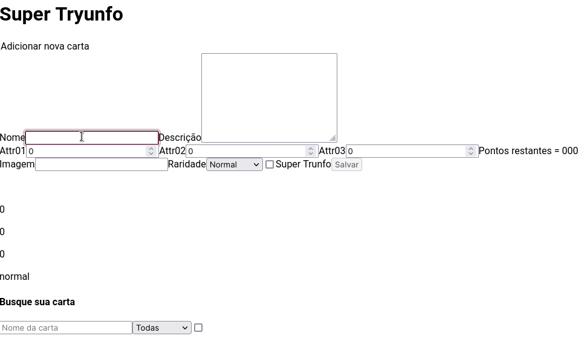
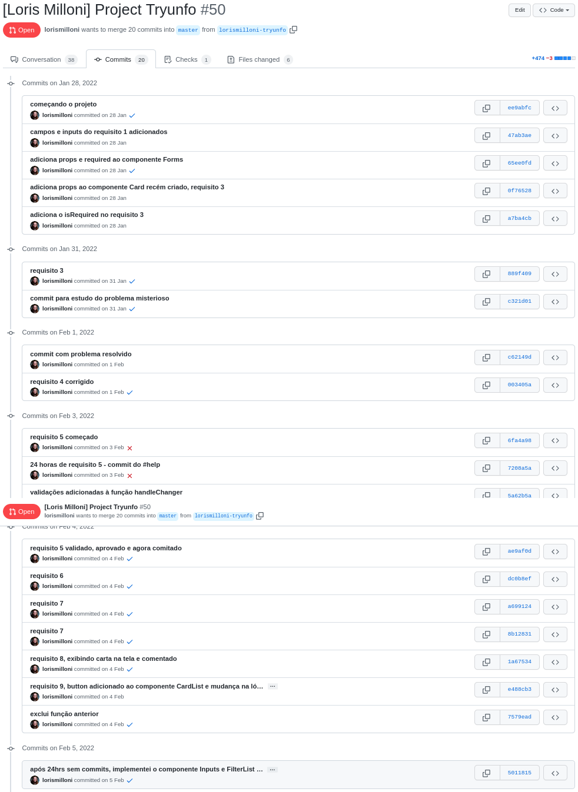
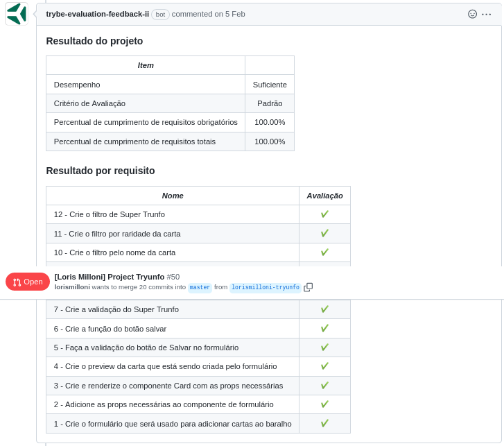

# studies-frontend-super-trunfo
Made in **31/01/2022**.

## In this assignment I was learning how to use state from React Components.
#### Here I manipulated state and lifecycle from React Components. I've also learned how to handle events, create forms with jsx syntax, and inheritance to reuse code between components. The goal was to add and remove cards, only add cards with complete field validation and view all the added cards. I didn't use css to style the web app.
   

#### You can see a gif from my application:

#### Trybe has a private repository with files that can't be shared. So here is my commit history print:

#### Here is the Trybe Evaluator

